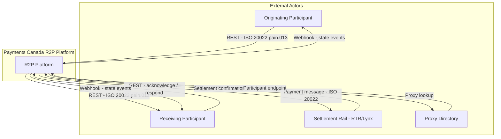
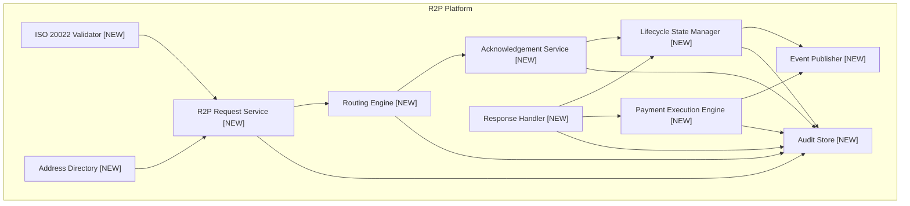
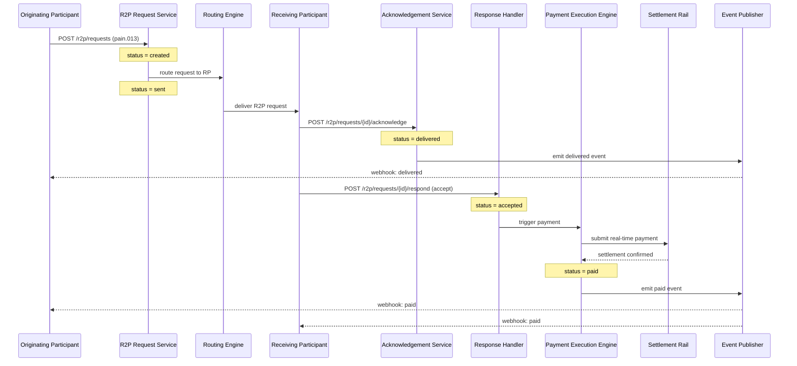
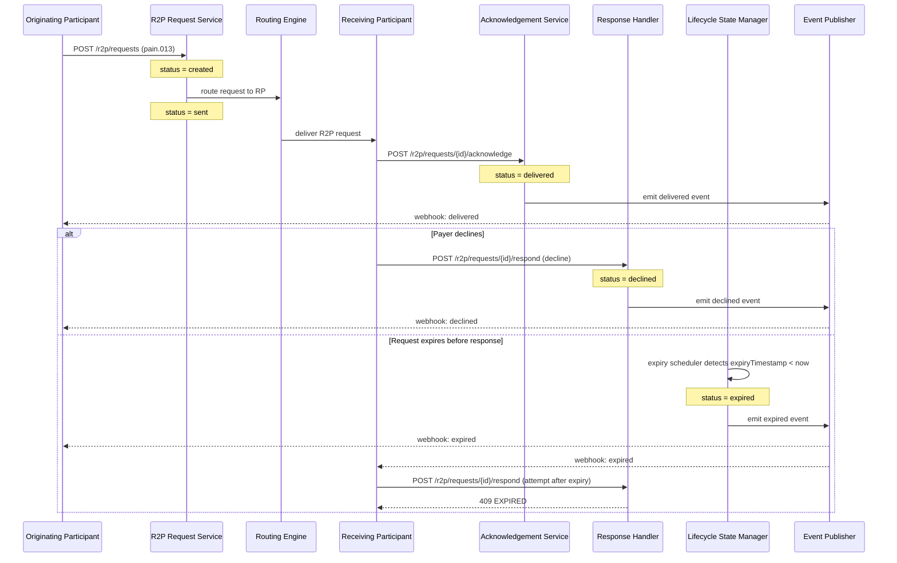

# Technical Design: R2P Platform

## System Context

This is a net-new platform for Payments Canada. It sits between financial institution participants as a central hub — not a bilateral integration. There is no existing Payments Canada R2P infrastructure to extend; every component below is new. The platform exposes REST APIs to participants and internally uses ISO 20022 message structures for all business events. It connects outward to a settlement rail (RTR or Lynx) for payment finality, and to a Proxy Directory for address resolution.

---

## New Components Required

**R2P Request Service**
The core domain service. Accepts inbound request creation, modification, and cancellation calls from originating participants. Validates all fields against ISO 20022 `pain.013` schema, enforces idempotency via a deduplication key, generates a globally unique R2P transaction ID (UUID v7 for time-ordering), and persists the request. Owns the state machine transitions from `created` through to terminal states.

**ISO 20022 Validator**
A stateless validation middleware that wraps all inbound and outbound messages. Performs schema validation against the relevant ISO 20022 message type (`pain.013` for request initiation, `pain.014` for response, `camt.087` for modification). Returns structured error codes on failure. Versioned separately so schema updates can be deployed without touching business logic.

**Address Directory**
Resolves a payer proxy identifier (email, phone, alias) to a routable participant endpoint and account reference. In POC: an in-memory static map seeded with test participants. In production: a dedicated registry with participant-managed entries and TTL-based caching.

**Routing Engine**
Receives a validated R2P message and a resolved participant endpoint from the Address Directory. Delivers the message to the receiving participant via HTTPS. Maintains delivery state (`pending`, `delivered`, `failed`). Implements exponential backoff retry (3 attempts, max 30s total) before marking delivery as failed and triggering a rejection response back to the originator.

**Acknowledgement Service**
Receives `POST /r2p/requests/{id}/acknowledge` calls from receiving participants. Records a timestamped acknowledgement against the request. Transitions request state from `sent` to `delivered`. Emits an `acknowledged` event to the Event Publisher.

**Response Handler**
Receives payer response calls (`accept`, `decline`, `defer`) from receiving participants. Validates the response against the original request: checks expiry, validates amount constraints, confirms request is in `delivered` state. On valid accept: triggers the Payment Execution Engine. On decline/defer: transitions state and notifies originating participant. Rejects responses to expired or terminal-state requests.

**Payment Execution Engine**
Triggered exclusively by an accepted R2P response. Constructs a real-time payment message referencing the R2P transaction ID. Submits to the settlement rail (RTR in POC: stubbed). On settlement confirmation, updates R2P status to `paid` and emits a `paid` event. On settlement failure, transitions to `payment_failed` and notifies both participants.

**Lifecycle State Manager**
Owns the canonical state machine. Persists every state transition with timestamp and actor. Runs a scheduled expiry job (every 60 seconds) that queries for requests where `expiry_timestamp < now` and status is not terminal, transitions them to `expired`, and emits expiry events. Provides the query API for status and history.

**Event Publisher**
Publishes real-time state change events to subscribed participants. POC implementation: webhook delivery via HTTPS POST to a participant-registered callback URL. Production: Kafka topic per participant with at-least-once delivery guarantees. Payload is an ISO 20022-wrapped event envelope.

**Audit Store**
An append-only log of every state transition, API call, validation result, and system event. Written on every mutation — never updated or deleted. Serves the audit query API. In POC: a dedicated PostgreSQL table with insert-only access. In production: immutable object storage (S3-compatible) with PostgreSQL index for querying.

---

## API Contracts

```
POST /r2p/requests
  Request:  { payerId, payeeId, amount, currency, dueDate, expiryTimestamp, remittanceInfo, idempotencyKey }
  Response: { r2pId, status: "created", createdAt }
  Errors:   400 VALIDATION_ERROR, 409 DUPLICATE_REQUEST

PATCH /r2p/requests/{r2pId}
  Request:  { amount?, dueDate?, expiryTimestamp?, remittanceInfo? }
  Response: { r2pId, status, updatedAt }
  Errors:   400 VALIDATION_ERROR, 404 NOT_FOUND, 409 INVALID_STATE_TRANSITION

DELETE /r2p/requests/{r2pId}
  Response: { r2pId, status: "cancelled", cancelledAt }
  Errors:   404 NOT_FOUND, 409 INVALID_STATE_TRANSITION

POST /r2p/requests/{r2pId}/acknowledge
  Request:  { participantId, receivedAt }
  Response: { r2pId, status: "delivered" }
  Errors:   404 NOT_FOUND, 409 ALREADY_ACKNOWLEDGED

POST /r2p/requests/{r2pId}/respond
  Request:  { responseType: "accept"|"decline"|"defer", participantId, respondedAt }
  Response: { r2pId, status }
  Errors:   400 VALIDATION_ERROR, 404 NOT_FOUND, 409 EXPIRED, 409 INVALID_STATE_TRANSITION

POST /r2p/payments
  Request:  { r2pId, paymentAmount, currency, payerId, payeeId }
  Response: { paymentId, r2pId, status: "processing" }
  Errors:   400 AMOUNT_MISMATCH, 404 R2P_NOT_FOUND, 409 INVALID_STATE_TRANSITION

GET /r2p/requests/{r2pId}
  Response: { r2pId, status, payerId, payeeId, amount, currency, dueDate, expiryTimestamp, createdAt, updatedAt }
  Errors:   404 NOT_FOUND

GET /r2p/requests/{r2pId}/history
  Response: { r2pId, transitions: [{ fromState, toState, timestamp, actor }] }
  Errors:   404 NOT_FOUND

POST /r2p/subscriptions
  Request:  { participantId, callbackUrl, eventTypes: ["delivered","responded","paid","expired","cancelled"] }
  Response: { subscriptionId, status: "active" }
  Errors:   400 VALIDATION_ERROR
```

---

## Data Models

```typescript
// types/domain.ts

type R2PStatus =
  | 'created' | 'sent' | 'delivered'
  | 'accepted' | 'declined' | 'deferred'
  | 'expired' | 'cancelled'
  | 'payment_processing' | 'paid' | 'payment_failed'

interface R2PRequest {
  r2pId: string                // UUID v7
  idempotencyKey: string
  payerId: string
  payeeId: string
  originatingParticipantId: string
  receivingParticipantId: string
  amount: number
  currency: string             // ISO 4217
  dueDate: string              // ISO 8601 date
  expiryTimestamp: string      // ISO 8601 datetime
  remittanceInfo: string
  status: R2PStatus
  createdAt: string
  updatedAt: string
}

interface R2PStateTransition {
  transitionId: string
  r2pId: string
  fromStatus: R2PStatus
  toStatus: R2PStatus
  actor: string                // participantId or 'system'
  timestamp: string
  reason?: string
}

interface R2PAcknowledgement {
  r2pId: string
  receivingParticipantId: string
  receivedAt: string
  acknowledgedAt: string
}

interface R2PResponse {
  responseId: string
  r2pId: string
  responseType: 'accept' | 'decline' | 'defer'
  respondingParticipantId: string
  respondedAt: string
}

interface R2PPayment {
  paymentId: string
  r2pId: string
  amount: number
  currency: string
  settlementRef: string
  status: 'processing' | 'settled' | 'failed'
  submittedAt: string
  settledAt?: string
}

interface ParticipantAddress {
  proxyType: 'email' | 'phone' | 'alias'
  proxyValue: string
  participantId: string
  accountRef: string
  ttlSeconds: number
}

interface EventSubscription {
  subscriptionId: string
  participantId: string
  callbackUrl: string
  eventTypes: string[]
  status: 'active' | 'suspended'
  createdAt: string
}
```

---

## Module Dependencies

```
ISO 20022 Validator      ← no dependencies (stateless middleware)
Address Directory        ← no dependencies (seeded data in POC)
Audit Store              ← no dependencies (append-only sink)

R2P Request Service      → ISO 20022 Validator, Address Directory, Audit Store
Routing Engine           → R2P Request Service, Audit Store
Acknowledgement Service  → R2P Request Service, Event Publisher, Audit Store
Response Handler         → R2P Request Service, Payment Execution Engine, Event Publisher, Audit Store
Payment Execution Engine → Settlement Rail (stubbed in POC), Event Publisher, Audit Store
Lifecycle State Manager  → R2P Request Service, Event Publisher, Audit Store
Event Publisher          → Participant webhook registry (EventSubscription table)
```

Existing Payments Canada systems affected: none in POC. Production would integrate with the RTR settlement rail and the Payments Canada participant registry.

---

## Implementation Order

1. **Database schema and migrations** — R2PRequest, R2PStateTransition, R2PAcknowledgement, R2PResponse, R2PPayment, EventSubscription, AuditStore tables
2. **ISO 20022 Validator** — stateless, no DB dependency; enables all downstream services
3. **Address Directory** — static seed data for POC participant map
4. **R2P Request Service** — create, modify, cancel endpoints; state machine core
5. **Routing Engine** — delivery to receiving participant with retry logic
6. **Acknowledgement Service** — receipt acknowledgement and state transition
7. **Response Handler** — payer response validation and routing
8. **Payment Execution Engine** — stubbed settlement rail integration
9. **Lifecycle State Manager** — status query, history API, expiry scheduler
10. **Event Publisher** — webhook delivery for all state change events
11. **Audit Store query API** — read-only audit endpoint for participants

---

## POC Simplifications

| Area | POC | Production |
|------|-----|------------|
| Settlement rail | Stubbed — auto-returns success after 500ms | Real RTR/Lynx integration |
| Address Directory | In-memory static map (5 test participants) | Live registry with participant-managed entries |
| Participant connectivity | Stub HTTP endpoints returning canned responses | Mutual TLS to real participant systems |
| Event delivery | Best-effort HTTPS POST, no retry queue | Kafka with at-least-once delivery and dead-letter queue |
| ISO 20022 validation | Schema validation only (XSD) | Full business rule validation per Payments Canada rulebook |
| Expiry scheduler | Runs every 60s in-process (setInterval) | Dedicated cron job or scheduled Lambda |
| Authentication | API key per participant | OAuth 2.0 client credentials with participant certificate |

---

## Risks and Mitigations

**Risk 1 — State machine race conditions**
Concurrent requests (e.g., payer responds while expiry job runs simultaneously) can cause conflicting state transitions. Mitigation: use optimistic locking on the R2PRequest row (`version` column); reject the second write with a 409 if the version has changed since read.

**Risk 2 — ISO 20022 schema versioning breaking participants**
Payments Canada may need to update message schemas as the standard evolves. Participants that haven't upgraded will fail validation. Mitigation: version the Validator as a separate deployable; support N and N-1 schema versions simultaneously; give participants a 90-day deprecation window before removing old schema support.

**Risk 3 — Webhook delivery failures silently dropping events**
If a participant's callback URL is down, the Event Publisher could silently lose events. Mitigation: persist every outbound event to an `OutboxEvent` table before delivery; mark as `delivered` only on HTTP 2xx; implement a background sweeper that retries `undelivered` events with exponential backoff up to 24 hours.

---

## Architecture Diagrams

### Diagram 1 — C1 System Context



*Shows R2P Platform as a central hub between two participant banks, the settlement rail, and the proxy directory.*

---

### Diagram 2 — C3 Component Diagram



*Internal component view showing data flow from validation through routing, acknowledgement, response, payment, and event emission.*

---

### Diagram 3 — Happy Path Sequence Diagram



*End-to-end happy path: request created → routed → delivered → accepted → payment settled → both participants notified.*

---

### Diagram 4 — Decline / Expiry Failure Path



*Shows two failure paths: explicit payer decline and silent expiry with a subsequent late-response rejection.*
